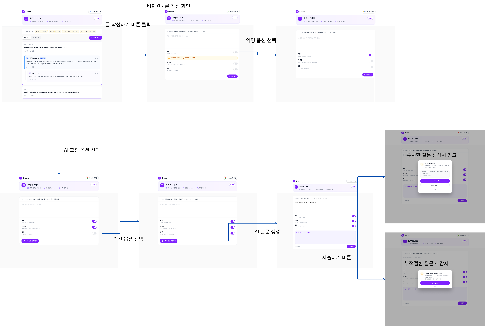
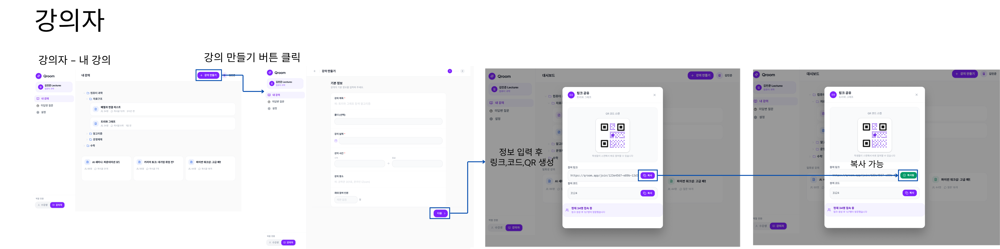
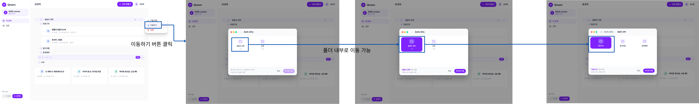
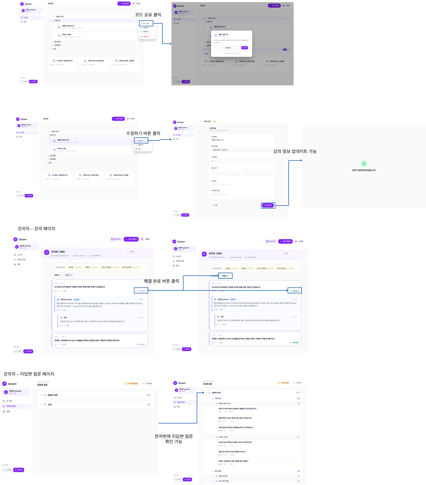
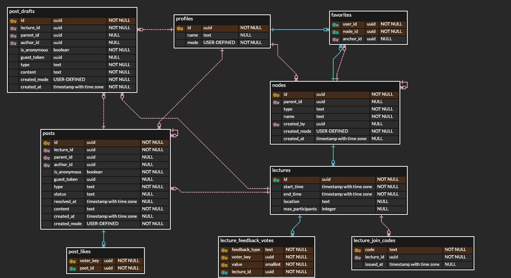

# 26s-w1-c3-07

## 공통과제 I : 웹 기반 프로젝트 (2인 1팀)

**목적:** 공통 과제를 함께 수행하며 웹 개발의 전체 흐름을 빠르게 익히고 협업에 적응하기

**결과물:** 기획부터 배포까지 완료된 웹 서비스와 관련 문서 일체

---

## 목차

- [팀원](#팀원)
- [기획안](#기획안)
- [기능 명세서](#기능-명세서)
  - [필수 기능](#필수-기능)
  - [선택 기능](#선택-기능)
- [IA 및 화면 설계서](#ia-및-화면-설계서)
- [DB 스키마](#db-스키마)
- [API 문서](#api-문서)
- [배포 결과물](#배포-결과물)
- [회고 문서](#회고-문서)
- [참고 자료](#참고-자료)

---

## 팀원

| 이름 | GitHub | 역할 |
|---|---|---|
|안소희|[soheean1370](https://github.com/soheean1370)|프론트엔드|
|조준호|[milleion](https://github.com/milleion)|백엔드|

---

## 기획안

> 프로젝트 주제, 목적, 핵심 기능, 예상 사용자, 팀원별 역할 등 정리

- **서비스명:** Qroom
- **주제:** 오프라인 강의 익명 질문 서비스

- **목적:** 오프라인 강의 중 수강생들이 부담 없이 익명으로 질문 및 의견을 남기고, 강의자가 실시간으로 이를 확인할 수 있게 하여 강의 중 의사소통의 진입 장벽을 낮춘다.

- **핵심 기능:**
  - URL/QR 코드로 익명(비회원) 강의 입장
  - AI 교정 기능을 통한 질문 문구 다듬기
  - AI를 이용해 부적절한 내용 필터링, 유사 질문 자동 탐지 및 처리
  - 실시간 피드백(추워요, 더워요 등) 전송
  - 트리형 구조로 여러 강의를 체계적으로 관리

- **예상 사용자:**
  - **수강생**: 강의에 입장해 질문을 남기는 유저 모드. 로그인하지 않은 비회원은 항상 이 모드.
  - **강의자**: 질문을 확인/관리하는 유저 모드. 로그인한 회원은 수강생 ↔ 강의자 모드를 전환할 수 있음.

---

## 기능 명세서

> 구현할 기능을 사용자 관점에서 정리하고, 필수 기능과 선택 기능을 구분

### 필수 기능

- **수강생**
    - 내 강의 페이지
        - 강의 및 강의 폴더 등록
        - 강의 공유 코드 입력 혹은 강의 선택으로 강의 입장
    - 강의 페이지
        - 메인 페이지의 강의 공유 코드 입력 혹은 URL/QR 코드로 비회원 입장 가능
        - 글 작성 및 제출
            - 글은 최상위 요소인 게시글과 이에 대한 답글로 분류됨
                - 글들은 트리 구조로 구성됨(답글에 대한 답글 작성 가능)
                - 미해결/해결됨 여부는 게시글에만 기록
            - 익명 여부: 기본은 익명, 회원은 등록된 이름으로 실명 전환 가능
            - AI 보조
                - 교정 기능(선택 가능): 글 초안을 AI가 다듬어 제안, 수강생이 확인 후 재수정 가능
                - 제출 시 등록 전에 적절성 검사(비속어 등 부적절한 내용 거부, 사유 안내)
                - 글 작성 시(답글 포함) 미해결 게시글들과의 유사도 검사 및 처리(유사한 질문 확인 / 강행 제출 / 질문 취소)
            - 질문/의견 여부 선택
                - 글은 질문/의견 두 타입 중 하나로 분류됨
                - 해결된 게시글에 대한 답글 작성 시 답글이 질문일 경우 다시 미해결로 이동, 의견일 경우 이동하지 않음
                - 질문은 자색, 의견은 청색으로 표시
            - 좋아요: 글마다 좋아요 개수 기록
            - 정렬
                - 미해결 게시글: 좋아요 개수, 같을 경우 제출 시각
                - 해결된 게시글: 해결된 시각
                - 답글: 제출 시각
        - 실시간 피드백(화면 상단 버튼으로 구현)
            - 총 4개: 추워요, 더워요, 소리가 작아요, 잘 안 보여요
            - 좋아요/싫어요

- **강의자**
    - 강의 생성, 수정, 삭제
        - 필수: 제목, 시작 시각, 종료 시각
        - 선택: 장소, 최대 참여 인원
    - 내 강의 페이지
        - 강의 및 강의 폴더 등록용 고유 코드(UUID) 공유
    - 강의 페이지
        - 강의 공유 코드(4자리 숫자) 및 URL/QR 코드 발급
        - 게시글 미해결 ↔ 해결됨 전환
        - 실시간 피드백 좋아요/싫어요 초기화
        - 게시글(최상위 글)은 작성 불가, 답글만 작성 가능(타입은 의견만 가능, 강의자의 답변은 청록색)
        - 부적절한 글 삭제
    - 미해결 질문 페이지

- **공통**
    - 회원 관리(구글 인증 사용)
    - 수강생 ↔ 강의자 모드 전환(강의자가 본인이 만들지 않은 강의실에 들어오면 자동으로 수강생 모드로 전환됨)
    - 내 강의 관리(트리형 구조): 강의 폴더 생성, 이름 수정, 위치 이동, 삭제
    - 등록한 글 수정 및 삭제(회원은 상시 가능, 비회원은 같은 토큰을 사용하는 한 계속 가능)
    - 수정 시 실시간 반영(새로고침 불필요)

### 선택 기능
- 내 강의 수동 정렬
- 글 등록 시 사진/파일 첨부
- 강의 종료 이후 자신의 글에 답글이 달리면 등록된 연락처로 알림
- 유료/무료 플랜, 결제
- 라이트/다크 모드 변환
- 유사 질문 탐지에 임베딩(pgvector) 기반 검색 도입

---

## IA 및 화면 설계서

> 서비스의 전체 페이지 구조와 페이지 간 이동 흐름; 각 페이지의 주요 UI 구성, 입력 요소, 버튼, 사용자 행동 흐름 등을 간단한 와이어프레임 형태로 정리

<!-- Figma 링크 또는 이미지 첨부 -->

---
## DB 스키마

> 필요한 테이블, 주요 필드, 데이터 타입, 테이블 간 관계를 정리

| 테이블 | 대응하는 기능 |
|---|---|
| `profiles` | 회원(Google OAuth) 부가정보 |
| `nodes` | 강의 폴더 + 강의 통합 트리 |
| `favorites` | "내 강의" 즐겨찾기 (수강생 모드) |
| `lectures` | 강의의 부가 속성 (시작/종료 시각, 장소, 최대인원) — 입장은 `nodes.id`(UUID)를 URL/QR로 사용 |
| `lecture_join_codes` | 강의 입장용 4자리 숫자 코드 (발급/재발급/파기 가능, 즐겨찾기 등록용 코드와는 별개). 발급/재발급은 `get_or_create_join_code()`/`reissue_join_code()` RPC로만 가능 |
| `lecture_feedback_votes` | 실시간 피드백(추워요/더워요/소리 작아요/잘 안 보여요) 좋아요/싫어요 |
| `posts` | 게시글 + 답글 통합 트리, 질문/의견 타입, 미해결/해결, 비회원 인증(`guest_token`) |
| `post_drafts` | `submit-post`(service_role) 전용 스크래치 테이블. 유사 질문 발견 시 최종 제출본을 임시 저장해뒀다가 강행 제출 시 `posts`로 옮김 |
| `post_likes` | 게시글/답글 좋아요 |

전체 SQL, 접근 제어(RLS 정책·테이블 권한), 트리거, 테이블 관계 상세 설명은 [`DB_DESIGN.md`](./DB_DESIGN.md) 참고.

---

## API 문서

> API 주소, 요청 방식, 요청값, 응답값, 에러 상황을 정리

| Type | Endpoint | 설명 | 요청 | 응답 |
|---|---|---|---|---|
| RPC | `delete_own_account` | 회원 탈퇴 (본인 `auth.users` 행 삭제) | 파라미터 없음, 로그인 필요 | 성공 시 없음(`void`), 실패 시 에러 메시지 |
| RPC | `get_my_favorite_subtrees` | 수강생 모드 "내 강의"에서 즐겨찾기한 노드들의 서브트리를 한 번에 조회 | 파라미터 없음, 로그인 필요 | 즐겨찾기 루트별 서브트리 행 목록(`anchor_node_id`로 그룹핑) |
| RPC | `get_or_create_join_code` | 강의 공유 코드 조회/발급 (있으면 반환, 없으면 그 자리에서 발급) | `p_lecture_id`(uuid), 강의 소유자로 로그인 필요 | 4자리 코드 문자열, 소유자가 아니면 에러 |
| RPC | `reissue_join_code` | 강의 공유 코드 재발급 (기존 코드 폐기 후 새로 발급) | `p_lecture_id`(uuid), 강의 소유자로 로그인 필요 | 새 4자리 코드 문자열, 소유자가 아니면 에러 |
| Edge Function | `ai-correct` | 글 초안을 AI로 다듬어 제안(적절성/유사도 검사 없음, 저장도 안 함) | `{ content }` | `{ corrected }` |
| Edge Function | `submit-post` | 글 제출: 적절성 검사 → (질문이면) 유사 질문 탐지 → 저장. 유사 질문 발견 시 `draft_id`로 강행 제출 가능(같은 함수 재호출) | `{ lecture_id, parent_id, type, content, created_mode, is_anonymous }` 또는 강행 제출 시 `{ draft_id }` | `{ result: 'created', post }` / `{ result: 'rejected', reason }` / `{ result: 'similar_found', draft_id, similar_id }` / `{ result: 'invalid', reason }`(필수 필드 누락, 권한 불일치, 잘못된 draft_id 등) |

Supabase 연동 방법(URL/API 키, 클라이언트 설정, 코드 예시)은 [SUPABASE_GUIDE.md](./SUPABASE_GUIDE.md) 참고, `submit-post`의 상세 계약은 [SUPABASE_GUIDE.md 10번](./SUPABASE_GUIDE.md#10-글-작성제출-ai-correct-submit-post-edge-function) 참고.

일반 테이블 조회/작성(select/insert 등)은 Supabase REST API 표준 패턴을 그대로 따르고, 테이블 구조는 [DB_DESIGN.md](./DB_DESIGN.md)에 정리되어 있어 위 표에는 따로 표기하지 않음. 이 표는 이름만으로는 파라미터/반환값을 알 수 없는 **RPC/Edge Function 전용**.

---

## 배포 결과물

> 접속 가능한 링크, 실행 방법, 주요 구현 내용

- **서비스 URL:** https://q-room.vercel.app/
- **실행 방법:** 위 URL에 접속하면 바로 이용할 수 있습니다.
  - **강의자**: 구글 로그인 → 강의 생성 → 발급된 4자리 공유 코드 또는 URL/QR을 수강생에게 공유
  - **수강생**: 로그인 없이도 공유받은 코드 입력 또는 URL/QR로 바로 강의 페이지에 입장해 질문·답글 작성 가능(로그인하면 실명 전환, 내 강의 목록 관리 등 추가 기능 이용 가능)
- **주요 구현 내용:**
  - 강의자/수강생 모드별 익명·실명 질문 트리, 좋아요, 실시간 피드백
  - AI 교정(`ai-correct`) + 적절성 검사·유사 질문 탐지(`submit-post`) Edge Function
  - Supabase Realtime(Presence + Broadcast)으로 접속자 수·게시글/피드백 실시간 갱신
  - 비회원도 안전하게 자기 글만 수정/삭제할 수 있는 `guest_token` 기반 인증
  - `pg_cron`으로 만료된 강의 공유 코드/오래된 임시 데이터 자동 정리

---

## 회고 문서

> 개발 과정에서의 어려움, 해결 방법, 역할 분담, 다음에 개선할 점 (KPT 방법론 참고)

### Keep

- 비회원 인증(`guest_token`)을 하나의 값으로 통일해 글 수정/삭제, 좋아요, 실시간 피드백, Presence 접속자 집계까지 전부 같은 방식으로 재사용할 수 있었음
- "허용은 RLS 정책, 차단은 트리거"처럼 역할을 나눠 설계하니 강의자 전용 기능(상태 전환, 피드백 초기화, 글 삭제)을 겹겹이 안전하게 구현할 수 있었음
- AI 기능(교정/적절성 검사/유사 질문 탐지)을 별도 Edge Function으로 분리해두니 이후 판별 로직을 몇 번 바꿔도(Moderation API → GPT 기반 커스텀 판별) 프론트/DB에 영향 없이 교체 가능했음
- 마이그레이션 파일을 세분화하고 커밋마다 라이브 DB에서 직접 시나리오를 재현·검증하는 습관 덕분에, 스키마 변경 중 데이터 무결성이 깨진 채로 배포되는 사고 없이 진행함

### Problem

- 강의실 실시간 갱신을 처음엔 `postgres_changes`로 구현했다가, 비회원 인증이 `x-guest-token` 헤더 비교라 WebSocket 연결에서는 평가가 안 돼 비회원이 이벤트를 못 받는 걸 뒤늦게 발견 — Broadcast from Database 방식으로 다시 구현해야 했음
- `posts` 테이블 SELECT 권한을 통째로 회수해두고 UPDATE/DELETE용 SELECT 정책을 깜빡해서, 답글 수정·질문 해결 처리가 42501 에러로 막히는 버그를 실사용 중에야 발견함
- Presence와 Broadcast 채널을 각자 별도로 열었다가, 같은 topic에 두 번째 연결이 붙으면 Realtime 서버가 먼저 연결을 끊어버려 접속자 수가 0으로 고정되는 버그를 겪음(하나의 채널로 통합해 해결)
- 문서(README/DB_DESIGN.md/SUPABASE_GUIDE.md)가 실제 구현보다 뒤처져 "아직 안 됨"이라고 남아있는 채로 방치되는 경우가 종종 있어, 주기적으로 문서-코드 정합성을 점검하는 절차가 필요했음

### Try

- 정원 초과 시 접속자 수 카운트에만 안 잡히는 지금 방식 대신, 강의실 입장 자체를 막을지 별도로 설계
- 정렬/집계처럼 여러 번 재발한 로직은 라이브 수동 검증뿐 아니라 자동화 테스트로도 커버해서 회귀를 더 빨리 잡기

---

## 참고 자료

- [SDD(스펙 주도 개발) 이해하기](https://news.hada.io/topic?id=21338)
- [Software Design Document Best Practices](https://www.atlassian.com/work-management/project-management/design-document)
- [IA 정보구조도 작성 방법](https://brunch.co.kr/@nyonyo/7)
- [기획자 화면설계서 작성법](https://brunch.co.kr/@soup/10)
- [Figma 와이어프레임 가이드](https://www.figma.com/ko-kr/resource-library/what-is-wireframing/)
- [무료 Figma 와이어프레임 키트](https://www.figma.com/ko-kr/templates/wireframe-kits/)
- [ERD/DB 설계 총정리](https://inpa.tistory.com/entry/DB-%F0%9F%93%9A-%EB%8D%B0%EC%9D%B4%ED%84%B0-%EB%AA%A8%EB%8D%B8%EB%A7%81-%EA%B0%9C%EB%85%90-ERD-%EB%8B%A4%EC%9D%B4%EC%96%B4%EA%B7%B8%EB%9E%A8)
- [API 명세서 작성 가이드라인](https://velog.io/@sebinChu/BackEnd-API-%EB%AA%85%EC%84%B8%EC%84%9C-%EC%9E%91%EC%84%B1-%EA%B0%80%EC%9D%B4%EB%93%9C-%EB%9D%BC%EC%9D%B8)
- [좋은 README 작성하는 방법](https://velog.io/@sabo/good-readme)
- [단기 프로젝트 회고 KPT 방법론](https://velog.io/@habwa/%EB%8B%A8%EA%B8%B0-%ED%94%84%EB%A1%9C%EC%A0%9D%ED%8A%B8-%ED%9A%8C%EA%B3%A0-KPT-%EB%B0%A9%EB%B2%95%EB%A1%A0)
